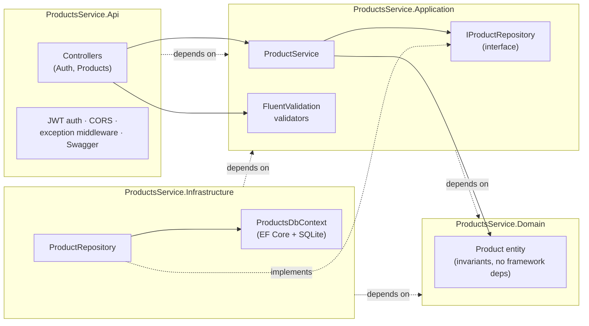
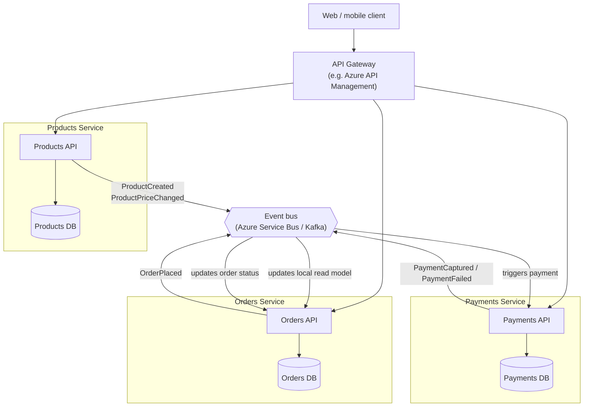

# Architecture

## 1. Inside the Products service

Standard layered / clean architecture, so business rules don't depend on
ASP.NET Core or EF Core:

`Domain` has zero dependencies on the other projects. `Application` defines
`IProductRepository` as an interface; `Infrastructure` is the only project
that knows about EF Core or SQL, and is wired in at startup via DI
(`AddInfrastructure`). That's what lets `ProductServiceTests` mock the
repository and test business rules (duplicate SKU rejection, colour
filtering) without a database.

## 2. As part of a larger, event-driven system

The brief asks how this Products service would sit inside a distributed /
microservices architecture alongside things like Orders and Payments. The
short version: Products stays the **owner of product data** and publishes
facts about it; it never calls other services synchronously to do its job,
and other services never write to its database.

Key points this diagram is making:

- **Database per service.** Orders doesn't query the Products database
  directly (no shared schema, no cross-service joins) — it keeps its own
  small read model of the product data it needs (id, name, price snapshot
  at order time), kept up to date by consuming `ProductCreated` /
  `ProductPriceChanged` events. This is why Orders shows the *price at the
  time of purchase* even if Products changes the price later.
- **Async, event-driven integration over synchronous REST-to-REST calls**
  between services for anything that isn't a direct user request — it
  decouples deploys/uptime (Orders can place an order even if Products is
  temporarily down; it just uses its last-known snapshot) and is the usual
  shape for "service A's write causes service B to react" flows.
- **The API Gateway** is the one synchronous, client-facing entry point;
  it's where cross-cutting concerns (auth, rate limiting, routing) live
  once there's more than one backend service, instead of every service
  re-implementing them.
- Products would emit its events from the same place `ProductService`
  already calls `_repository.AddAsync` — e.g. via a `IEventPublisher`
  abstraction (same pattern as `IProductRepository`: interface in
  `Application`, real implementation — Service Bus, Kafka, etc. — in
  `Infrastructure`), or by reading an outbox table so the DB write and the
  event publish are atomic (the transactional outbox pattern), which
  matters once this needs production-grade delivery guarantees.
